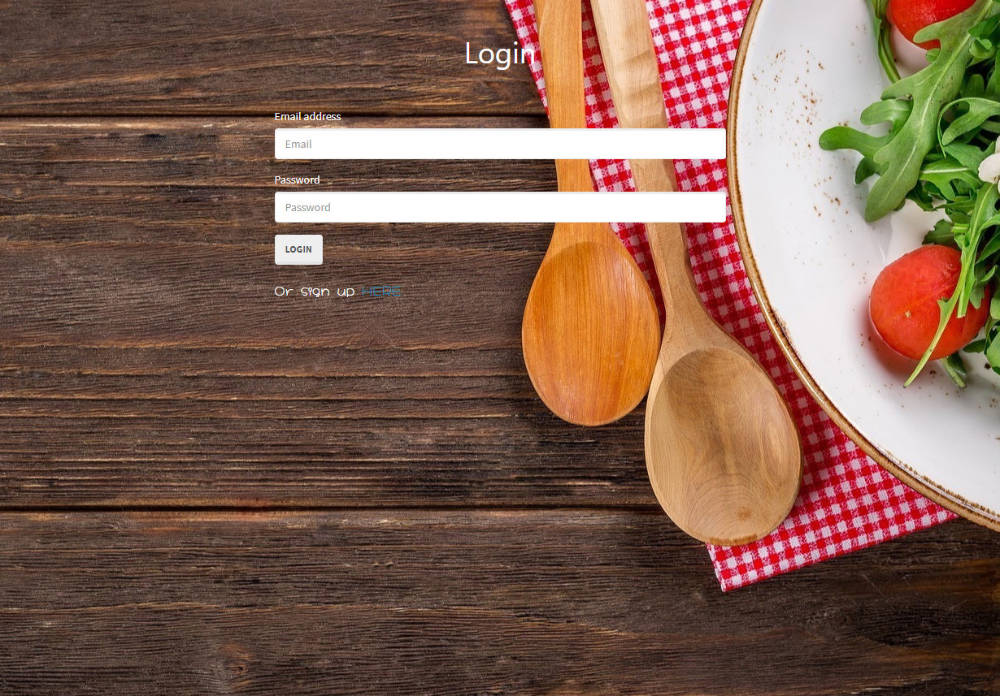

  
  # Food-Dad-a-Base

  ## Table Of Contents
  - [Description](#description)
  - [User story](#userstory)
  - [Contributing](#contributing)
  - [Example](#example)
  - [Presentation](#presentation)

  ## Description 
  Introducing the most amazing recipe finder and shopping list creater out! Designed to help find and favorite 
  recipes while bringing you a laugh along the way. 

  ## User Story
  AS A user, I want to be able to look up recipies and be able to save my favorites for later and have a laugh while doing so. 

  I WANT to be able to create a shopping list of ingredients that I need for the recipe. 

  SO THAT I can easily find something new or an old favorite and create a grocery list for the ingredients that I will need. 
  

  ## Contributing
  [Antonio Gonzalez](http://github.com/goantonioUW),
  [Michael Frisch ](http://github.com/mfrisch87),
  [Jailanie Kaganovsky](http://github.com/jkaganovsky),
  [Hector (Bryan) Moreno ](http://github.com/bfourGitHub),
  [Benjamin Domschot ](http://github.com/Bdomschot)

  ## Example
    Screenshots of the application.
  
  
  
  ## Presentation
  
  

